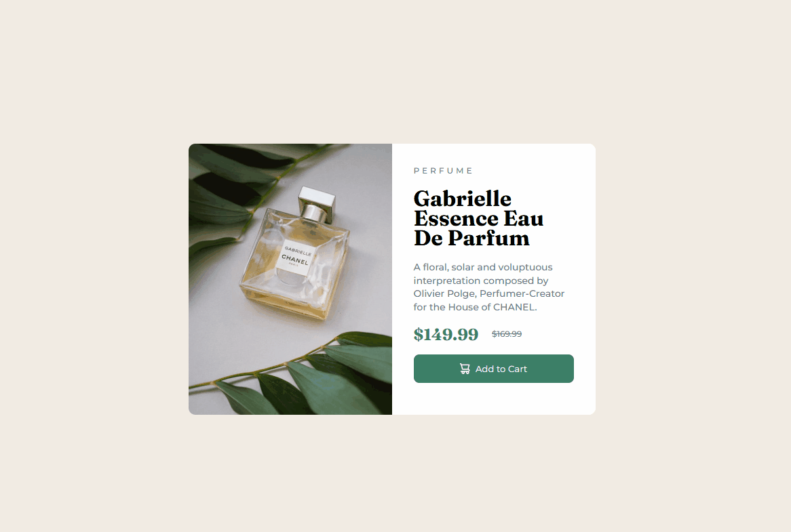

# Frontend Mentor - Product preview card component solution

This is a solution to the [Product preview card component challenge on Frontend Mentor](https://www.frontendmentor.io/challenges/product-preview-card-component-GO7UmttRfa). Frontend Mentor challenges help you improve your coding skills by building realistic projects. 

## Table of contents

- [Overview](#overview)
  - [The challenge](#the-challenge)
  - [Screenshot](#screenshot)
- [My process](#my-process)
  - [Built with](#built-with)
  - [What I learned](#what-i-learned)
  - [Continued development](#continued-development)
- [Author](#author)

## Overview

### The challenge

Users should be able to:

- View the optimal layout depending on their device's screen size
- See hover and focus states for interactive elements

### Screenshot




## My process

- Started working on the HTML of the page, stablishing all the elements according to the design provided.
- Once the HTML was done, I started to work with the CSS to style the page according to what was provided as design.
- I started with Desktop First, then I moved to a mobile media query.

### Built with

- Semantic HTML5 markup
- CSS custom properties
- Flexbox
- Desktop-first workflow


### What I learned

The major learning here was to use the tag `picture` to change the Perfume photography according to the user's device.

```html
<picture>
          <source srcset="images/image-product-mobile.jpg" media="(max-width: 375px)">
          
        </picture>
```
```css
@media (max-width: 375px) {

    .content {
        flex-direction: column;
        width: auto;
        height: auto;
        margin: 1rem;
    }
    
    .item-photo picture {
        width: 100%;
        height: 100%;
        object-fit: cover;
    }
}
```

### Continued development

Still want to continue to progress using FlexBox and to understand better without consulting online.


## Author

- Instagram - [@dirijomal](https://instagram.com/dirijomal)
- LinkedIn - [Márcio Rodrigues](https://www.linkedin.com/in/m%C3%A1rcio-rodrigues-b97a78239/)

I'm Marcio, Frontend developer and screenwriter from Brazil. Eager to learn and to develop.
